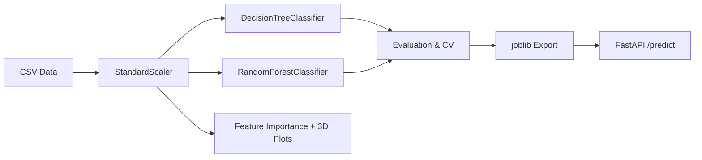

# Tree-Based Learning: Decision Trees & Random Forests

---

## Overview

This project demonstrates **Decision Trees** and **Random Forests** applied to two real-world prediction problems. Starting with Gini impurity and information gain, it progresses through recursive partitioning, pruning via hyperparameters, and the transition from a single tree to a bagged Random Forest ensemble with feature subsampling.

The same pipeline is applied to two independent datasets from entirely different domains, demonstrating that tree-based models generalize across problems.

| Concept | Description |
|:---|:---|
| **Decision Tree** | Learns human-readable IF-THEN rules by recursively splitting data on feature thresholds |
| **Random Forest** | Builds hundreds of trees on random data/feature subsets; majority vote reduces variance |
| **Feature Importance** | Measures how much each feature reduces impurity across all trees |
| **Class Imbalance** | Handled via stratified splitting and evaluated with precision, recall, F1 |
| **Ensemble Principle** | Many weak learners combined outperform one strong learner; errors cancel out |

---

## Datasets

### Dataset A: EV Battery Thermal Runaway Prediction

A synthetic dataset of 8,000 battery telemetry records. The task is to predict whether a lithium-ion battery will experience thermal runaway (fire) based on charging and environmental conditions including charge_rate_kw, ambient_temp_c, cooling_flow_rate, cell_voltage_variance, and age_cycles.

The dataset is heavily imbalanced (95% safe, 5% thermal runaway), requiring stratified splitting and careful evaluation using precision, recall, and confusion matrices.

### Dataset B: Wafer Edge Yield Drop-off (Post-Silicon Validation)

A synthetic dataset of 10,000 wafer die measurements. The task is to predict whether a die passes or fails yield testing based on its spatial position and process parameters including distance_from_center_mm, angle_degrees, etch_gas_flow, spin_coat_rpm, and litho_overlay_error_nm.

The 90/10 class split makes minority-class (fail) detection challenging, and the spatial nature of the data introduces domain-specific visualization opportunities.

---

## Repository Structure

```
003_tree_based_learning/
├── assets/                                        # All notebook-generated visualizations
│   ├── proj1_battery_eda.png                      # Battery: feature distributions (Safe vs Runaway)
│   ├── proj1_battery_decision_tree.png            # Battery: trained Decision Tree with Gini splits
│   ├── proj1_battery_tree_structure.png           # Battery: detailed tree structure + split thresholds
│   ├── proj1_battery_feature_importance.png       # Battery: Random Forest feature importance
│   ├── proj1_battery_feature_importance_both.png  # Battery: DT vs RF importance comparison
│   ├── proj1_battery_model_comparison.png         # Battery: DT vs RF performance metrics
│   ├── proj1_battery_roc_comparison.png           # Battery: ROC curves DT vs RF
│   ├── proj1_battery_model_heatmap.png            # Battery: confusion matrix heatmap
│   ├── proj1_battery_3d_features.png              # Battery: 3D feature space scatter
│   ├── proj1_battery_3d_decision_surface.png      # Battery: 3D DT decision surface
│   ├── proj1_battery_ensemble_intuition.png       # Battery: bagging + subsampling intuition
│   ├── proj1_battery_flowchart.png                # Battery: AI-generated pipeline flowchart
│   ├── proj2_wafer_map_analysis.png               # Wafer: actual pass/fail spatial distribution
│   ├── proj2_wafer_feature_analysis.png           # Wafer: feature distributions + correlations
│   ├── proj2_wafer_actual_vs_predicted.png        # Wafer: actual vs predicted wafer maps
│   ├── proj2_wafer_predicted_map.png              # Wafer: model-predicted yield map
│   ├── proj2_wafer_3d_spatial.png                 # Wafer: 3D spatial features scatter
│   └── proj2_wafer_flowchart.png                  # Wafer: AI-generated pipeline flowchart
├── data/
│   ├── ev_battery_thermal_runaway.csv             # 8,000 battery records (5 features + target)
│   └── wafer_edge_yield.csv                       # 10,000 wafer die records (5 features + target)
├── deploy/
│   ├── Dockerfile                                 # Container image for FastAPI server
│   └── docker-compose.yml                         # Single-command deployment
├── docs/
│   ├── Tree_Based_Learning_Report.html            # Report source (HTML with embedded images)
│   └── Tree_Based_Learning_Report.pdf             # Final PDF report (both projects)
├── models/
│   ├── rf_battery.pkl                             # Trained RandomForest for battery (Acc = 0.9994)
│   └── rf_wafer.pkl                               # Trained RandomForest for wafer (Acc = 0.8975)
├── notebooks/
│   ├── 01_tree_based_ev_battery.ipynb             # Full pipeline: EDA → DT → RF → metrics → 3D
│   └── 02_tree_based_wafer_yield.ipynb            # Wafer: spatial analysis → DT → RF → wafer maps
├── src/
│   ├── train.py                                   # Train RandomForest for both datasets
│   ├── predict.py                                 # Load model and run batch predictions
│   ├── api.py                                     # FastAPI POST /predict endpoint
│   └── data_generator.py                          # Generate synthetic datasets
├── tests/
│   └── test_model.py                              # Model existence + prediction shape tests
├── requirements.txt
├── .gitignore
└── LICENSE
```

---

## Quick Start

```bash
# Clone
git clone https://github.com/AIML-Engineering-Lab/003_tree_based_learning.git
cd 003_tree_based_learning
pip install -r requirements.txt

# Generate datasets
python3 src/data_generator.py

# Open notebooks
jupyter notebook notebooks/

# Train models and save artifacts (both datasets)
python3 src/train.py

# Run predictions
python3 src/predict.py

# Start API server
uvicorn src.api:app --host 0.0.0.0 --port 8000

# Run tests
python3 tests/test_model.py
```

---

## Tech Stack

| Tool | Version | Purpose |
|:---|:---|:---|
| Python | 3.12+ | Core language |
| NumPy | 1.24+ | Numerical operations |
| Pandas | 2.0+ | Data manipulation |
| scikit-learn | 1.3+ | DecisionTreeClassifier, RandomForestClassifier, metrics, CV |
| Matplotlib | 3.7+ | All visualizations including 3D |
| Seaborn | 0.12+ | Statistical plots, heatmaps |
| FastAPI | 0.100+ | REST API serving |
| Joblib | 1.3+ | Model serialization |

---

## Architecture



---

## License

MIT License. See [LICENSE](LICENSE) for details.
